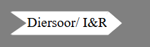
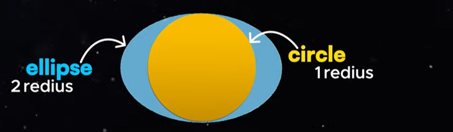
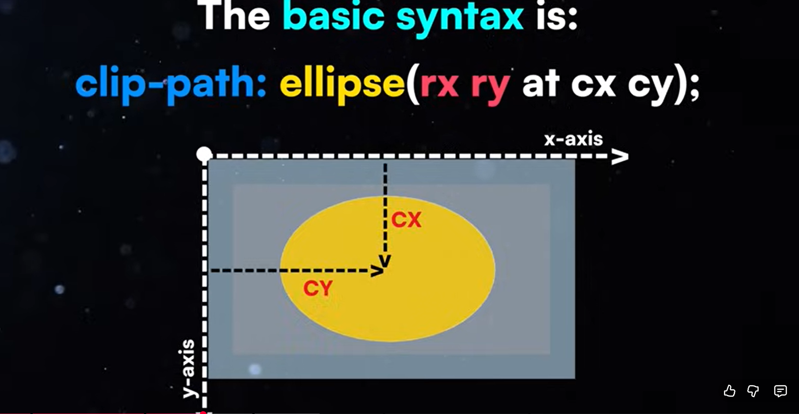
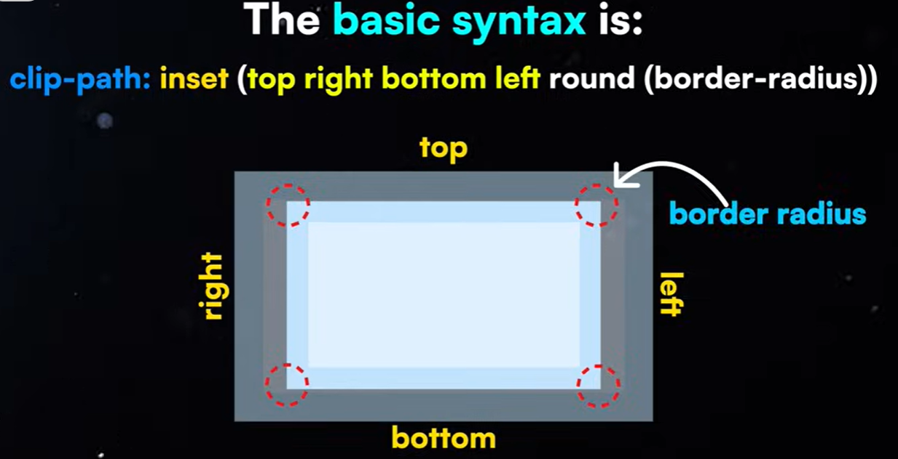
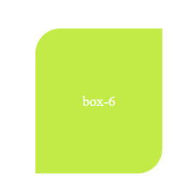

here i learn about clip-path property in css to provide custome shapes to elements
clip path provides multiple functions which performs different actions eg : - 

- clip-path: polygon(),
- clip-path: circle(),
- clip-path: ellipse(),
- clip-path: inset(),
- clip-path: path()
and many more

1 - polygon()

-webkit-clip-path: polygon(...) kya hota hai?

clip-path kisi bhi element ki shape cut kar deta hai. Matlab element normally rectangle hota hai, but clip-path se tum uski custom shape create kar sakte ho.

polygon() means tum shape ko points ke through define kar rahe ho.
Har point ek coordinate hota hai: x% y%

Example:

clip-path:polygon(20px 50%, 0% 0%, 100% 0%, 100% 100%, 0% 100%)

 <!-- polygon(
    20px 50%,
    0% 0%,
    calc(100% - 20px) 0%,
    97% 50%,
    calc(100% - 20px) 100%,
    0% 100%
  ); -->

Ye bol raha hai:

Start karo 20px from left, middle height (50%)

Fir top-left corner

Fir top-right

Fir bottom-right

Fir bottom-left

Iska result hai ek shape jo left side se thoda cut jaisa dikh raha hai (stepper ka pointed effect).
Basically tum rectangles ko arrow / angled look de rahe ho.

Why used here?
Because stepper ka design continuous ribbon jaisa hai jisme har step ek chevron (▶️ jaisa) shape me dikhna chahiye.

clip-path generator tool :- https://unused-css.com/tools/clip-path-generator
tool-2 :- https://bennettfeely.com/clippy/

2 - clip-path:circle(50px at right top) circle appear at right side top side

3- clip-path:ellipse()

ellipse is very similar to circle but more flexiable, it let you crop elements in ovul shape

4 - inset shape (clip-path:inset())
lets you crop the rectangular area from an element

syntax :-

eg-1:- clip-path: inset(20px 30px 40px 10px round 10px); /*here inset(top,right,bottom,left round 10px rounded)*/

eg-2:-clip-path: inset(20px 30px round 28px 0); /*here inset(toprigth bottomleft round 28px 0(other two regular edges))*/

polygon:-

yt-tutorial - https://www.youtube.com/playlist?list=PLrEX5wDo7gnHccTJxhoVBIzC18kdRzOO5
